# VidaLink

VidaLink is a healthcare and gamification platform that rewards
users for approved contributions and allows them to redeem points
for rewards.

## 🚀 Live Application

- Frontend: https://vidalink-v2-frontend.vercel.app
- Backend: https://vidalink-v2-backend.onrender.com

> The backend is hosted on Render's free tier and may take a few
> moments to wake up after a period of inactivity.

## 🛠️ Tech Stack

- Angular
- TypeScript
- SCSS
- JWT Authentication
- REST API
- Vercel

## 🖥️ Application Preview

> The backend is hosted on Render's free tier and may take a few moments
> to wake up after a period of inactivity.

### Authentication

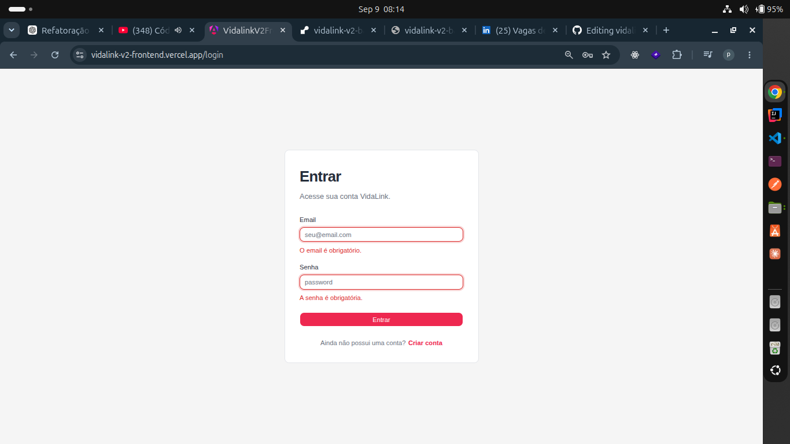
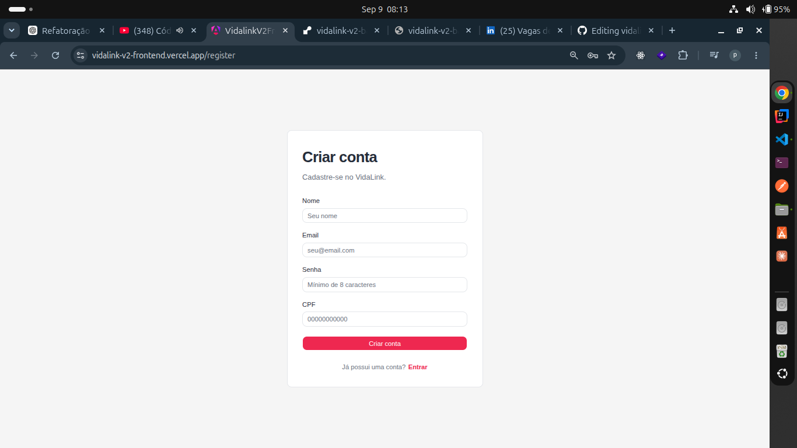

### User Home

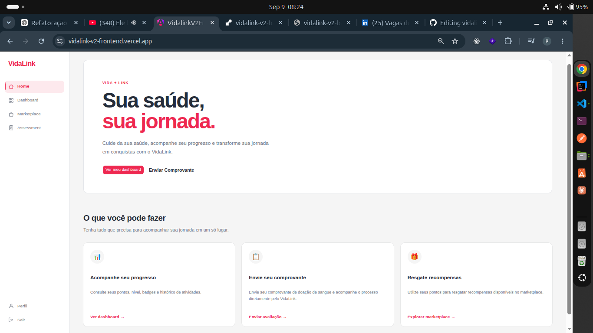

### User Dashboard

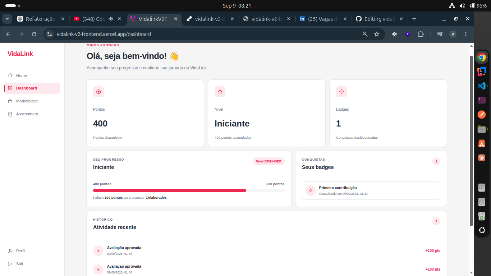

### Rewards Marketplace

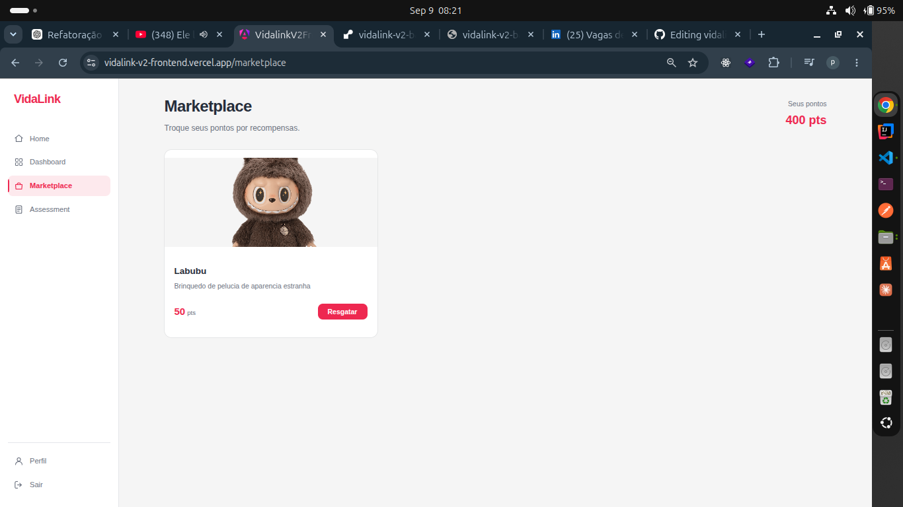

### Submission Assessment

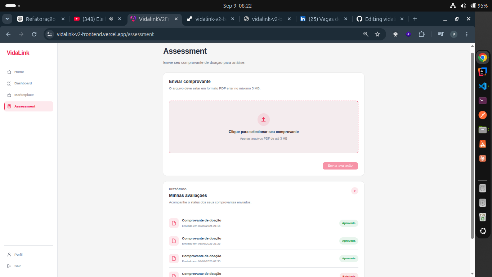

### Admin Dashboard

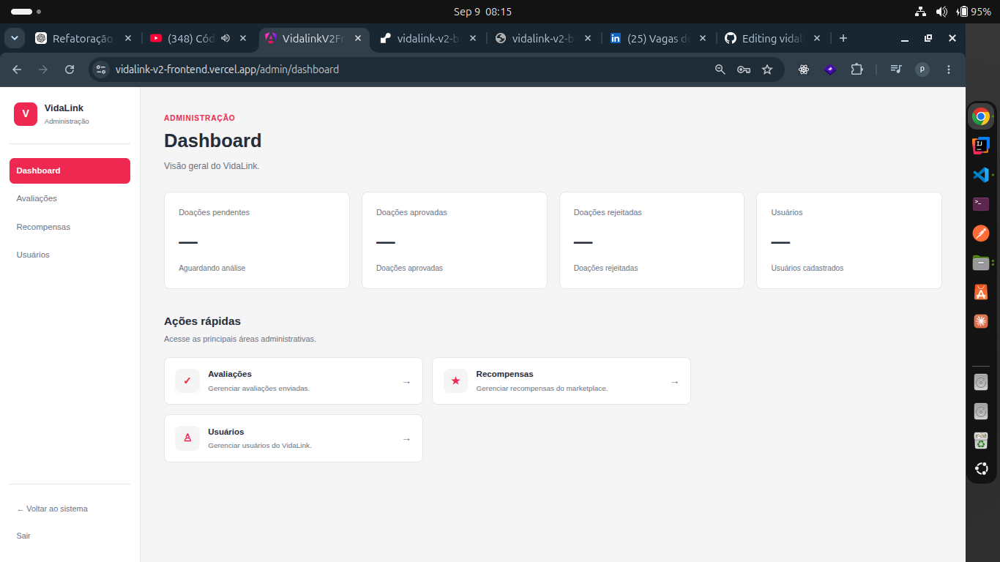

### Submission Review

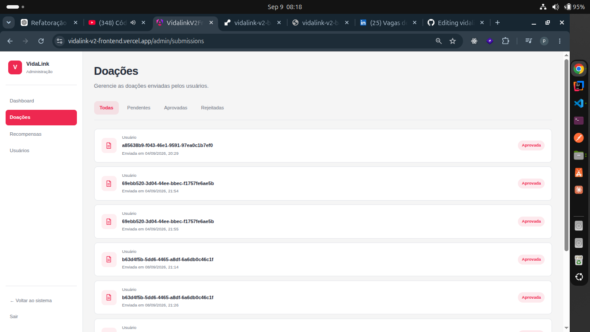

### Admin Rewards

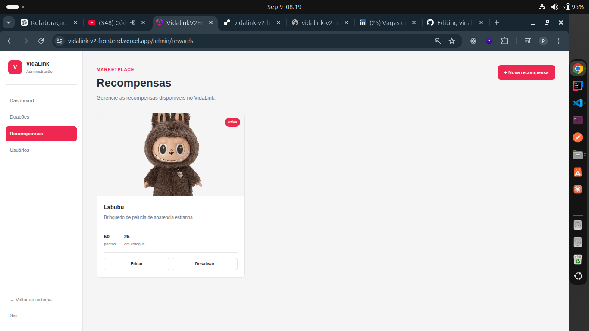
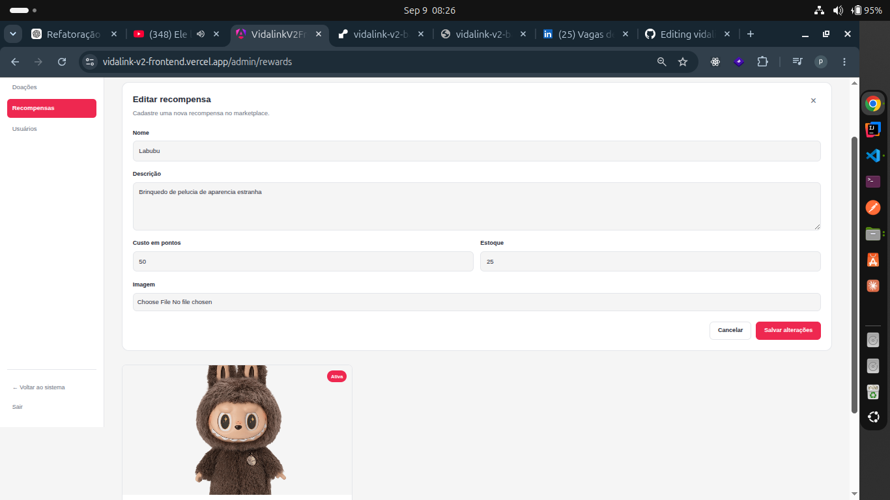

### Admin Management

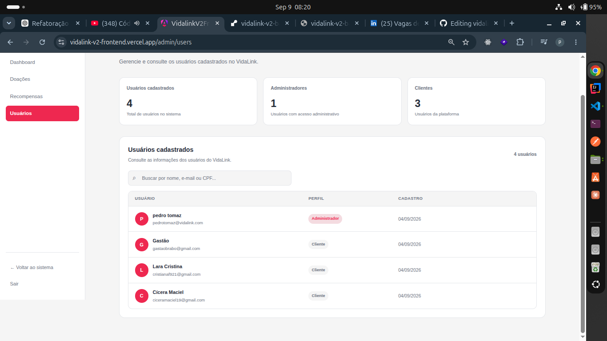
